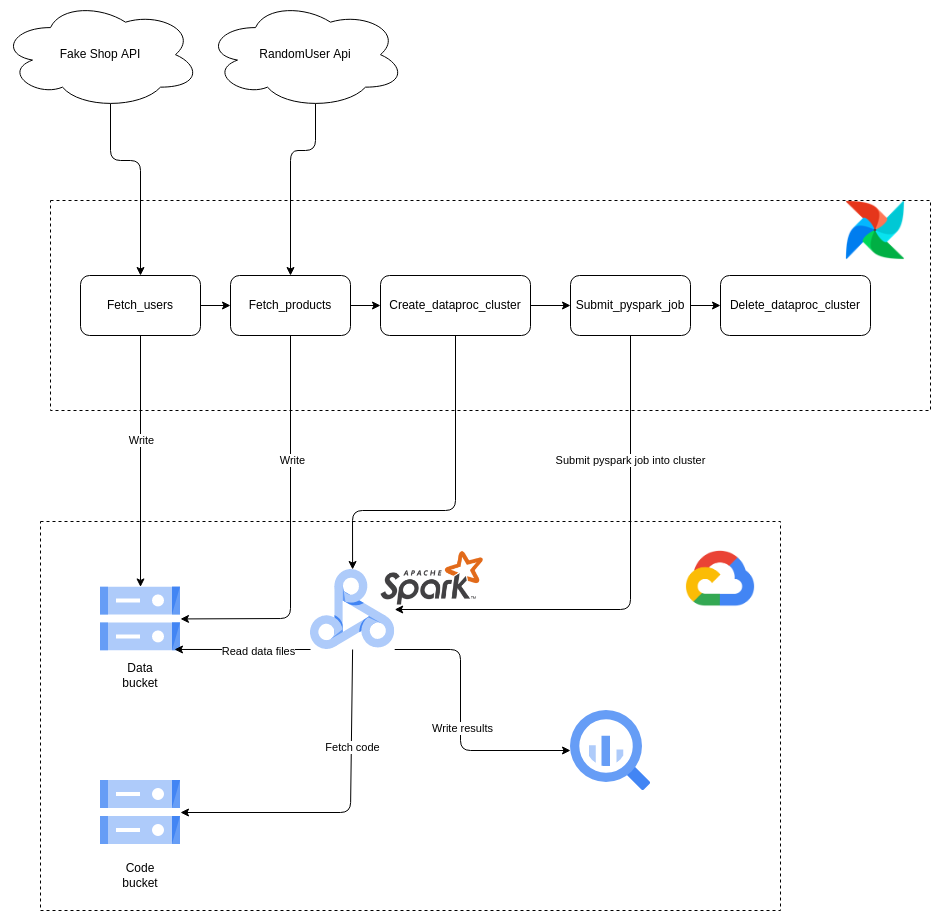

# Shop_data_pipe_line_project

This project seeks to emulate an e-commerce data collection pipeline and generate fictitious orders.



This project uses Docker to work. If you want to run it, you will need Docker first. 

Use the following commands to run the Docker Compose:
```
mkdir -p ./logs 
echo -e "AIRFLOW_UID=$(id -u)" > .env
docker-compose up airflow-init
docker-compose up -d

```

If you don't have a GCP account, you can create one free for 90 days. [HERE](https://cloud.google.com/])

Additionally, enter your GCP credentials into the airflow connections and create a project and bucket in the GCP console with the following names.

```
 BUCKET     : fake_shop_bucket
 PROJECT_ID : fake-shop-data-pipeline
```

If you want to use another name, you need to modify the file project_config.

```
dags/
├─ config/
│  ├─ project_config.py
```